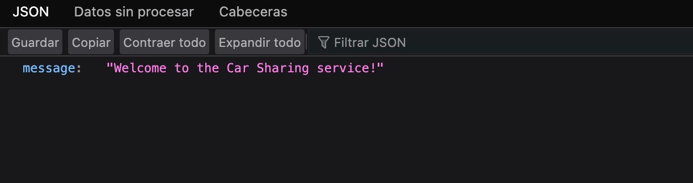
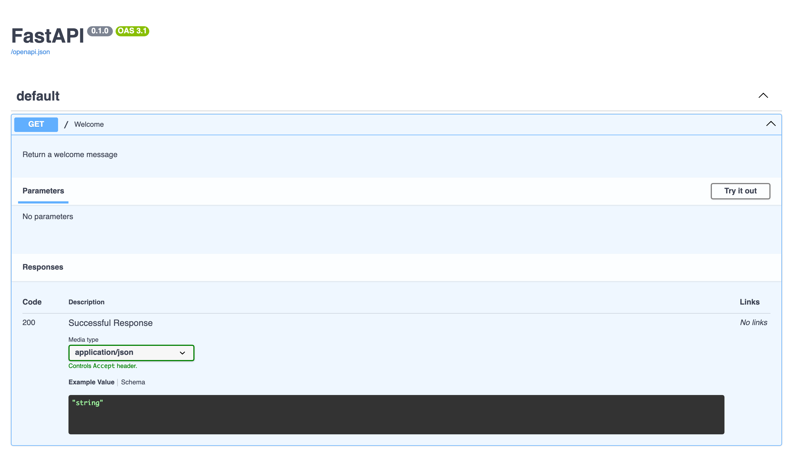
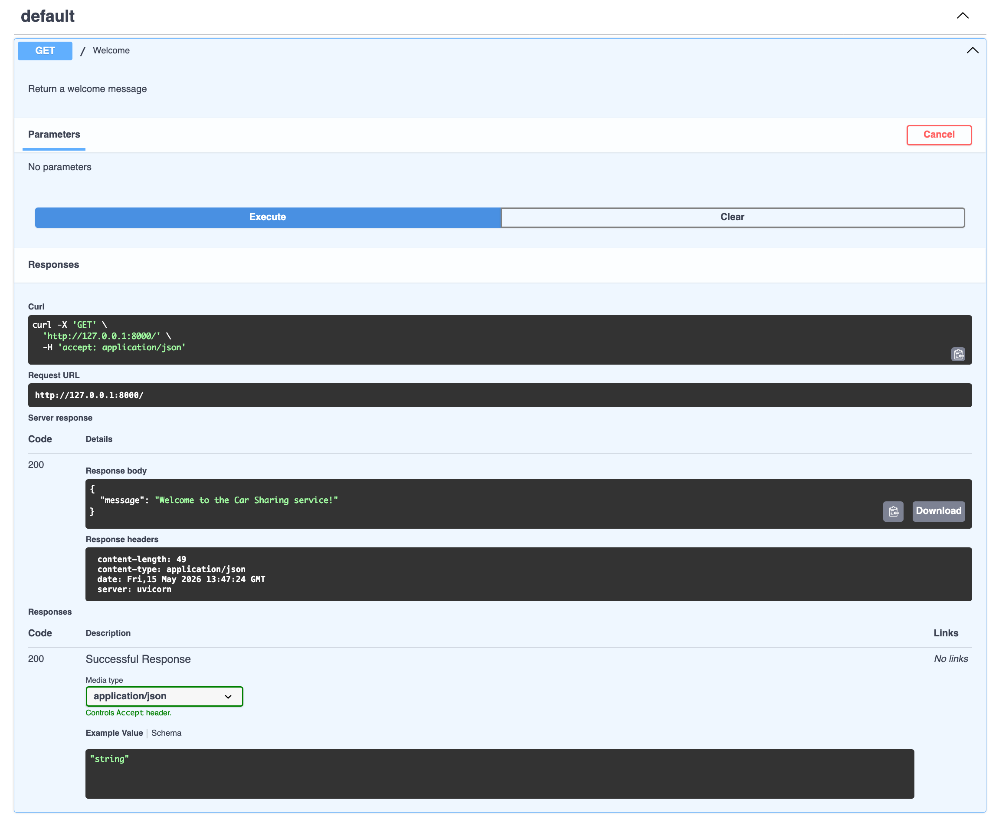
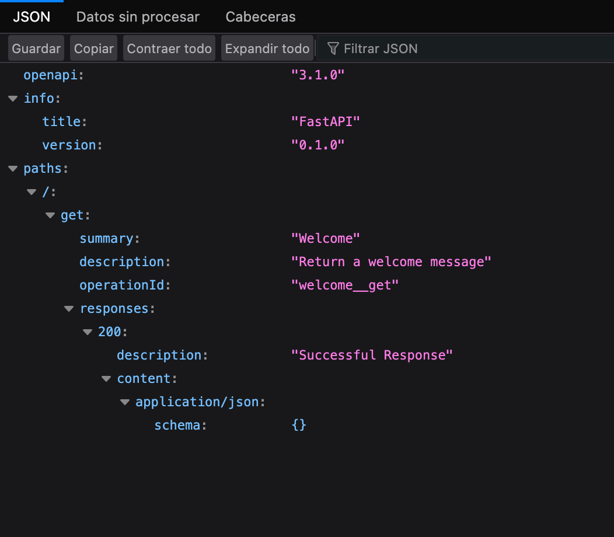
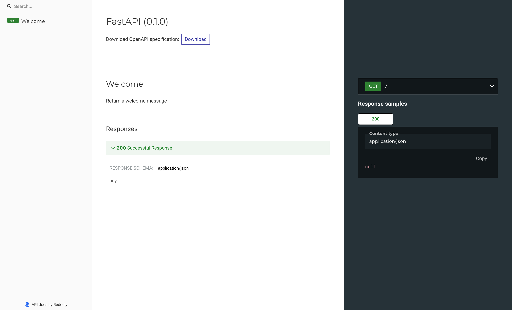
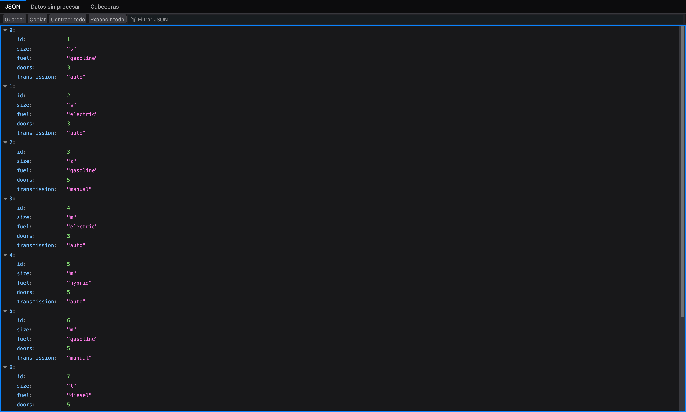

# FastAPI Fundamentals
For this course I will be developing a REST API for car sharing.
---

[FastAPI docs](https://fastapi.tiangolo.com/)

## Create a Python environment

For MacOS
```sh
python -m venv venv
source venv/bin/activate
```

Install FastAPI with all of its components, including uvicorn to use as server.

```sh
pip install 'fastapi[all]'
```

## Creating a REST API with FastAPI

[First lesson](fastapi-learning/fastapi-fundamentals/01_carsharing.py)

```python
from fastapi import FastAPI

app = FastAPI()

@app.get("/")
def welcome():
    """Return a welcome message"""
    return {"message": "Welcome to the Car Sharing service!"}
```

With `app = FastAPI()`  we call the FastAPI constructor that will create a global application object.

With `def welcome():` we define a function that returns a welcome message. The object we return is a dictionary with a "message" key and a "value" being the text we want to show.

The following docstring that explains what the function does will be useful for the API documentation.

All of this by itself it's just a function, but thanks to the line `@app.get("/")` it's transformed into a *path operation*. 

- The *@* is an decorator. 
- The *app.get* is an attribute of the app object that we created above, that together with the *@* will decorate the welcome function and will assign a url to it. In this case it assigns the "/" endpoint. The *get* refers to the GET operation that will use the function in our API.

To serve the api we run
```sh
fastapi dev 01_carsharing.py
```

We use *dev* mode now because it detects any change that we make to the code and automatically updated the API. That is not good for a production environment but it's useful now.

The uvicorn server will start running at [http://127.0.0.1:8000](http://127.0.0.1:8000), and we can open it and see the result of our function.



FastAPI will automtically create the API documentation in [http://127.0.0.1:8000/docs](http://127.0.0.1:8000/docs).



It show that our API contains a single operation called "Welcome" that supports GET requests. It shows the docstring in our function, the expected return status codes for the operation, and if we click in *Try ir out* it allows us to call the operation from this page to test it. 



If we click on the [/openapi.json](http://127.0.0.1:8000/openapi.json) link on top, we are sent to an openapi specification document of the Welcome operation.



If we go to [http://127.0.0.1:8000/redoc](http://127.0.0.1:8000/redoc) we can see the documentation in a diferent format.



> ### Control flow
> This script doesn't run from top to bottom. The Uvicorn server process controls the flow of our code. And here our program does nothing until an http request comes in.

## [Serving data](fastapi-learning/fastapi-fundamentals/02_carsharing.py)

Later, we will create a real database, but right now we can add our information by hand to the python code of the api to simulate a database.

```python
db = [
    {"id": 1, "size": "s", "fuel": "gasoline", "doors": 3, "transmission": "auto"},
    {"id": 2, "size": "s", "fuel": "electric", "doors": 3, "transmission": "auto"},
    {"id": 3, "size": "s", "fuel": "gasoline", "doors": 5, "transmission": "manual"},
    {"id": 4, "size": "m", "fuel": "electric", "doors": 3, "transmission": "auto"},
    {"id": 5, "size": "m", "fuel": "hybrid", "doors": 5, "transmission": "auto"},
    {"id": 6, "size": "m", "fuel": "gasoline", "doors": 5, "transmission": "manual"},
    {"id": 7, "size": "l", "fuel": "diesel", "doors": 5, "transmission": "manual"},
    {"id": 8, "size": "l", "fuel": "electric", "doors": 5, "transmission": "auto"},
    {"id": 9, "size": "l", "fuel": "hybrid", "doors": 5, "transmission": "auto"}
]
```

This is a list of dictionaries that contains information about cars.

To define a function that returns all cars in the database:

```python
@app.get("/api/cars")
def get_cars():
    return db
```

> When developing a REST API, it's common to prefix our urls with "api".

Now, if we go to [http://127.0.0.1:8000/api/cars](http://127.0.0.1:8000/api/cars) we can see the full list of cars that our database has.



